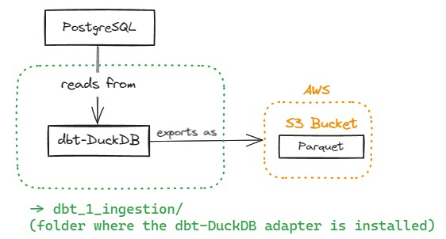

# ETL - Part 1 of 2 - Leveraging dbt-DuckDB to perform Ingestion Step (Reading from Postgres, converting to Parquet, and saving them into an S3 Bucket).



## Table of Contents

- [Project Structure](#project-structure)
- [Setup Instructions](#setup-instructions)
  - [Prerequisites](#prerequisites)
  - [Environment Variables](#environment-variables)
  - [Build and Run](#build-and-run)
- [Services](#services)
- [dbt](#dbt)
- [Ingestion Step](#ingestion-step)

## Project Structure

- **name_of_your_project_repo (project-root)/**
    - **.devcontainer/**
      - devcontainer.json
    - **.dbt**
      - profiles.yml (connection details for our database environments)
    - **analyses**
    - **dbt_packages**
    - **logs** (ignored in git)
      - dbt.log
    - **macros**
      - **tests**
        - date_format.sql (macro to ensure date columns have date format)
      - generate_schema_name.sql (this macro makes sure your database schemas' names are respected)
    - **models**
      - **sources**
        - sources.yml
      - **bronze**
        - bronze_dbt_model_1.sql
        - properties.sql
    - **seeds**
    - **snapshots**
    - **target** (ignored in git)
    - **tests**
    - **.env**
    - **.gitignore**
    - **dbt_project.yml**  (the main file: this is how dbt knows a directory is a dbt project)
    - **packages.yml**     (where dbt packages should be configured)
    - **package-lock.yml** (created by dbt when the 'dbt deps' is executed against the packages.yml)
    - **README.md**
    - test_duckdb.ipynb    (create to serve as a simple way to run queries against DuckDB)

## Setup Instructions

### Prerequisites

Make sure you have the following installed on your local development environment:

- [Docker](https://www.docker.com/get-started)
- [Docker Compose](https://docs.docker.com/compose/install/)
- [VSCode](https://code.visualstudio.com/) with the [Remote - Containers extension](https://marketplace.visualstudio.com/items?itemName=ms-vscode-remote.remote-containers)

Make sure to inclue a .gitignore file with the following information:

*.pyc          (to ignore python bytecode files)
.env           (to ignore sensitive information, such as database credentials)
target/        (to ignore compiled SQL files and other build artifacts that are generated when dbt runs)
dbt_packages/  (to ignore where dbt installs packages, which are specific to your local environment)
logs/          (to ignore logs)
data/          (to ignore CSV files)

### Environment Variables
The ´.env´ file is in the folder above the dbt folder. For this specific dbt folder, it is not necessary. 
If you want to check, do:
* cd /workspace
* printenv (this will show if the environmental variables were loaded within the Docker container)
* printenv | grep S3 (this functions as a filter to show only the variables that contain 'S3')

### Build and Run

1. **Clone the repository:**

   ```bash
   git clone https://github.com/caiocvelasco/end-to-end-data-science-project.git
   cd end-to-end-data-science-project

2. **Build and start the containers:**

  When you open VSCode, it will automatically ask if you want to reopen the repo folder in a container and it will build for you.

**Note**: I have included the command `"postCreateCommand": "docker image prune -f"` in the **.devcontainer.json** file. Therefore, whenever the docker containeirs are rebuilt this command will make sure to delete the `unused (dangling)` images. The -f argument ensures you don't need to confirm if you want to perform this action.

### Services

* **Postgres**: 
  * A PostgreSQL database instance.
  * Docker exposes port 5432 of the PostgreSQL container to port 5432 on your host machine. This makes service is accessible via `localhost:5432` on your local machine for visualization tools such as PowerBI and Tableau. However, within the docker container environment, the other services will use the postgres _hostname_ as specified in the `.env` file (`POSTGRES_HOST`).
  * To test the database from within the container's terminal: `psql -h $POSTGRES_HOST -p 5432 -U $POSTGRES_USER -d $POSTGRES_DB`
* **dbt**: The Data Build Tool (dbt) for transforming data in the data warehouse.
* **Jupyter Notebook**: A Jupyter Notebook instance for interactive data analysis and for checking the models materialized by dbt.

### dbt

dbt (Data Build Tool) is a development environment that enables data analysts and engineers to transform data in their warehouse more effectively. To use dbt in this project, follow these steps:

1. **Install dbt**: The Dockerfile and Docker Compose file will do this for you.
2. **Configure database connection**: The `profiles.yml` was created inside a `.dbt` folder in the same level as the `docker-compose.yml`. It defines connections to your data warehouse. It also uses environment variables to specify sensitive information like database credentials (which in this case is making reference to the `.env` file that is being ignored by `.gitignore`, so you should have one in the same level as the `docker-compose.yml` - as shown in the folder structure above.)
3. **Install dbt packages**: Never forget to run `dbt deps` so that dbt can install the packages within the `packages.yml` file.
4. **Run DBT**: Once dbt is installed and configured, you can use it to build your dbt models. Use the `dbt run` command to run the models against your database and apply transformations.

### Ingestion Step

**Steps Summary**
The step-by-step migration will be done for one table in Bronze. Then, we need to replicate for all the other tables.

1) Ensure your environment is ready.
  * The Dockerfile and Docker Compose file will do this for you. You just need to open the repo with VSCode (make sure to have the prerequisites, as mentioned in the `Prerequisites` section above).
  * Check if the docker's bash terminal in VSCode can retrieve the environment variables: `env | grep POSTGRES`
  * Make sure to add the external CSV files to `external_postgres/data`.

2) Ingest CSV files to Postgres (**This will function as a Postgres in PRODUCTION**)
  * Run the `ingestion_in_raw.ipynb` noteboook.
  * This will create the necessary schemas (`raw`) by executing the `external_postgres/create_schemas.sql` script and tables (same names as the CSV files) in Postgres and insert the data from the CSV files.

3) Configure your `profiles.yml`.
  * `profiles.yml` is located under the `dbt_1_ingestion/.dbt/` folder.
  * This repo container the necessary information in `profiles.yml` to use DuckDB as an adapter.
4) Organize your dbt project directory.
  * `dbt_project.yml` file:
    * Under the `models > my_dbt_project` section, include only the bronze layer, because the `dbt_1_ingestion` project only performs the ingestion step.
  * `packages.yml` file:
    * It was created by me and not by dbt.
    * This file will specify the dependencies your project needs.
    * Make sure that the `dbt-utils` package is compatible with your `dbt-core` version (https://hub.getdbt.com/dbt-labs/dbt_utils/latest/)
    * Install dbt Packages:
      * `dbt clean` (to clean dependencies),
      * then `dbt deps` (this will look for the `packages.yml` file that should be in the same level as `dbt_project.yml`.)
  * `models/` folder: 
    * Contains the dbt models (i.e., SQL scripts or *.sql files) for the bronze layer.
    * For each layer (e.g.: `models/s3_bucket`) there is a `properties.yml` file. This file is where you specify data columns, tests, and any other property you want to ensure at each table in the schema. 
    * `models/sources/sources.yml`: Sources make it possible to name and describe the data loaded into your warehouse by your Extract-Load tool, i.e., the data from the CSV that was ingested into the bronze schema in DuckDB. When referencing these "source" tables in the dbt models, make sure to use the `{{ source('source_name','table_name') }}` jinja.
      * Notice that the `source_name` is defined with the `name:` tag in the `sources.yml` file.
  * `macro/` folder:
    * Here you create macros to use in your project.
    * An example is the `macro/tests/date_format.sql`. I created this macro in a `test/` folder to ensure that the date columns have a date format.
    * To apply this test, you need to put it in the `date_tests:` section of the `properties.yml` for the respective schema.
    * Moreover, you will find a `generate_schema_name.sql` macro that makes sure that the name we chose for the schema (i.e., the `dbt_caio` name) is the one being used when the schemas are created in DuckDB.

3) Test Connection to S3 Bucket
  * Run the `test_s3_Access.ipynb` noteboook.

4) Run dbt for the first dbt project (`dbt_1_ingestion/`)
  * run: `cd /workspace/dbt_1_ingestion` in the Docker Bash Terminal.
  * run: `dbt debug` in the Docker bash terminal (this makes sure the database connection is working).
  * run: `dbt run` in the Docker Bash Terminal.
    * dbt will materialize the tables that DuckDB read from the `raw` schema in PostgreSQL and save them on a subfolder of a S3 Bucket as Parquet (`s3://YOUR_S3_BUCKET_NAME/parquet-output`). 
    * The tables will also be materialized in DuckDB within the `dbt_caio` schema, following the best practices that are written as comments in the `profiles.yml` file.
  * Overall: DuckDB will read from PostgreSQL and write into the subfolder of your S3 Bucket as Parquet files.
